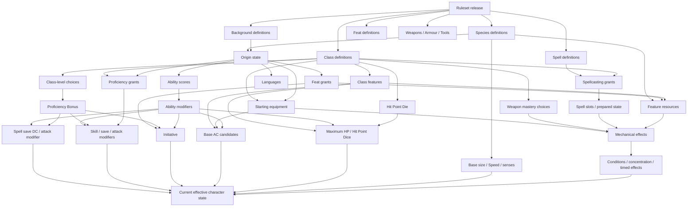

# GandalfDnD Character-System Research and Implementation Study for SRD 5.2.1

## Executive direction, scope and licensing boundary

**Research conclusion.** GandalfDnD should treat **SRD 5.2.1 as an immutable, versioned rules package**, not as prose that the application interprets dynamically. The official D&D Beyond SRD page identifies 5.2.1 as the current downloadable SRD, published 1 May 2025, and states that later errata may produce further independently licensed SRD versions rather than silently replacing earlier ones. That makes ruleset pinning a natural fit for persistent campaigns. citeturn23view0

The highest-value architectural decision is therefore:

> **The same character state + the same validated command + the same recorded dice results + the same ruleset revision must always produce the same mechanical events and resulting state.**

Randomness should be isolated in a roll service; rules resolution itself should be pure and deterministic. A saved campaign should never change merely because GandalfDnD deploys a newer SRD package.

No matching GandalfDnD repository was available through the connected GitHub installation during this research, so the architecture, schema and service recommendations below are **greenfield implementation proposals**, not claims about the existing Gandalf codebase.

**Normative authority.** The report uses the official **System Reference Document 5.2.1** as the controlling rules source. Its table of contents places Character Creation on pp. 19–26, Classes on pp. 28–82, Character Origins on pp. 83–86, Feats on pp. 87–88, Equipment beginning p. 89, Spells beginning p. 104, the Rules Glossary beginning p. 176, and the Gameplay Toolbox beginning p. 192. citeturn25view1 The official conversion guide is used only to clarify changes in terminology and structure from SRD 5.1, such as *species*, *armour training*, the revised tool-proficiency interaction, the Magic action, the reordered creation procedure and multiclass changes. citeturn25view0

**Licensing boundary.** SRD 5.2.1 is released under **CC-BY-4.0**. Its legal page requires the attribution specified there and explicitly permits stating that a work is “compatible with fifth edition” or “5E compatible”. The shipping product should reproduce the attribution **directly from SRD p. 1**, rather than reconstructing it from this report. citeturn25view1 The official SRD FAQ further states that omitted material is deliberately outside the SRD and that future SRD versions remain independently available under Creative Commons. citeturn23view0

That means GandalfDnD should use the following content boundary:

| Classification | GandalfDnD treatment |
|---|---|
| **Official SRD 5.2.1** | Implement as normative mechanics with source-page provenance. |
| **Official SRD customisation rules** | Supported where explicitly present, for example *Creating a Background* on pp. 192–193. These are not house rules. citeturn12view3turn13view0 |
| **Official FAQ / conversion guide** | Clarification and migration metadata only; never allowed to override the actual 5.2.1 text without an explicit documented interpretation. citeturn23view0turn25view0 |
| **Commercial-book content absent from SRD** | Unsupported and legally out of the requested scope. The official FAQ specifically explains that some classes, species, monsters and protected names are omitted from SRD 5.2. citeturn23view0 |
| **Community interpretation** | No community source was required for the conclusions in this report. If added later, it should be labelled non-authoritative commentary. |
| **Gandalf house rules** | Must have their own namespace, version, enablement flag and visible UI label. They must never masquerade as SRD mechanics. |

The app's own name, trade marks, artwork, third-party fiction and other non-SRD intellectual property should receive a separate legal review. CC-BY licensing of the SRD does not turn unrelated material into SRD content; the SRD itself limits its grant to the material it contains. citeturn25view1turn23view0

**Delivery classification.**

| Delivery tier | Required scope |
|---|---|
| **Implement now for level-one character creation** | Ruleset pin; five-step creation workflow; all twelve classes' level-one traits/features; four supplied backgrounds plus a decision on exposing official custom backgrounds; nine species; languages; ability-generation methods; background ability adjustments; alignment; Origin feats; level-one spell choices; equipment; armour training; weapon proficiencies; weapon-mastery selections; proficiencies; starting HP and Hit Point Dice; AC; initiative; speed; senses; Heroic Inspiration; level-one feature resources. |
| **Required before basic combat** | D20 tests; advantage/disadvantage; action, Bonus Action and Reaction economy; initiative; movement; attacks; critical hits; damage/healing; resistance/vulnerability/immunity; Temporary HP; 0 HP/death saves; all conditions; cover; weapons and armour; Light-property attacks; all eight mastery properties; spell targeting/components; spell attacks/DCs; concentration; one-spell-slot-per-turn rule; Short/Long Rests; equipment state and feature-resource expenditure. |
| **Required for advancement and higher levels** | XP thresholds; class-level progression; subclass selection; feats and prerequisites; spell/preparation growth; replacement choices; resource scaling; Extra Attack; multiclassing; multiclass spell slots; Pact Magic interaction; Metamagic; invocations; Focus Points; Wild Shape; higher-level mastery interactions; Ability Score Improvement; Epic Boons; level-20 features and optional post-20 feat advancement. |
| **Required for narrative/world-state integration** | Languages, senses, travel, carrying capacity, exploration actions, social attitudes, world facts, character-history events, consequences, typed adjudication requests, story causality and strict separation between narrative claims and mechanical state. |
| **Optional future house rules** | Character milestones, signature moments, ultimate abilities, numeric reputation systems, solo-compensation rules, resurrection protection, bespoke injury systems, extra rerolls, encounter difficulty smoothing, unrestricted respecs. |
| **Unsupported / out of scope** | Any option, subclass, species, feat, spell, item, monster, setting, named character or lore imported from a commercial D&D source unless it independently appears in SRD 5.2.1 or is separately licensed/user-supplied under an explicit content pipeline. |

A particularly important scope detail is **official custom backgrounds**. The Gameplay Toolbox allows creation/customisation of a background by choosing three relevant abilities, one Origin feat, two skills, one tool and a 50 GP equipment package, with restrictions on including Martial weapons or armour. That mechanic is part of SRD 5.2.1, not homebrew. citeturn12view3turn13view0

## Canonical character state, terminology and dependency graph

**Rules terminology glossary.**

| Term | Meaning for the implementation |
|---|---|
| **Species** | Character-origin choice giving creature type, size, Speed and species traits. Ability-score increases and default languages do **not** come from species in SRD 5.2.1. citeturn25view0 |
| **Background** | Origin choice providing three eligible abilities for the ability adjustment, an Origin feat, two skill proficiencies, a tool proficiency and starting equipment/GP. citeturn4view0turn25view0 |
| **Class** | The character's principal progression package: Hit Point Die, proficiencies/training, features, advancement choices and possibly spellcasting. Classes begin on SRD p. 28. citeturn25view1 |
| **Subclass** | Class specialisation gained through the class's progression; the SRD supplies one subclass for each of its twelve classes. citeturn25view1 |
| **Class feature** | A rule granted by reaching a specified class level; it may grant choices, resources, actions, spells, modifiers or further features. |
| **Feat** | A selectable package with a category, possible prerequisites, benefits and sometimes a Repeatable rule. Categories represented in SRD 5.2.1 are Origin, General, Fighting Style and Epic Boon. citeturn4view4turn4view5 |
| **Epic Boon** | A feat category whose SRD entries generally require level 19+. Class level-19 features permit an Epic Boon feat or another feat for which the character qualifies. citeturn4view5turn18view4 |
| **Proficiency Bonus (PB)** | Level-based bonus applied where proficiency or another explicit rule permits. It is +2 at levels 1–4, +3 at 5–8, +4 at 9–12, +5 at 13–16 and +6 at 17–20. It cannot normally be added more than once to the same number. citeturn12view0turn12view1 |
| **Skill proficiency** | Permission to add PB to applicable ability checks involving that skill. The associated ability is typical rather than an immutable property of every possible check; rules/GM adjudication determines the ability used in context. citeturn12view1 |
| **Expertise** | Doubles PB for the ability checks to which the feature applies. PB can be multiplied only once and divided only once. citeturn12view0 |
| **Saving-throw proficiency** | Permission to add PB to saving throws using the specified ability. citeturn12view1 |
| **Armour training** | Current terminology for using armour without the penalties attached to lacking training; this replaces older “armour proficiency” terminology. citeturn24view1turn25view0 |
| **Weapon Mastery** | A class-feature system giving access to a weapon's mastery property for selected weapon kinds. The eight SRD mastery properties are Cleave, Graze, Nick, Push, Sap, Slow, Topple and Vex. citeturn4view7turn4view8 |
| **Prepared spell** | A spell currently made available by a spellcasting feature or other grant. “Always prepared” grants should remain distinct from ordinary preparation limits. |
| **Spell slot** | Consumable casting resource. Ordinary Spellcasting slots and Pact Magic slots must remain distinct even though multiclass rules allow certain cross-use. citeturn18view2turn3view7 |
| **Condition** | Temporary game state. SRD conditions do not stack with themselves, except Exhaustion. citeturn16view1turn16view2 |
| **Heroic Inspiration** | At-most-one reroll resource that can be expended immediately after rolling a die; the replacement result must be used. citeturn12view0turn13view2 |
| **Character level** | Sum of all class levels. It drives PB and some scaling rules such as cantrips and species traits. Multiclass mechanics require it to be separate from individual class levels. citeturn3view6turn3view7 |
| **Class level** | Level in a particular class; drives that class's feature table and many class-specific scaling rules. |
| **Character milestone** | **Gandalf design concept, not an SRD character mechanic in this report.** Recommended as a persistent narrative/event marker only unless a house-rule package grants it mechanical effects. |
| **Signature moment** | **Gandalf design concept, non-SRD.** A story event/tag. Do not confuse it with the Wizard's official level-20 **Signature Spells** feature. The latter is an SRD class feature. citeturn15view1 |
| **Ultimate ability** | **Gandalf design concept, non-SRD.** It must not be used as a substitute name for a class capstone, level-20 feature or Epic Boon. |

The SRD character-creation process has five ordered steps: choose a class; determine origin by choosing a background, species and languages; determine ability scores; choose alignment; then fill in the remaining character details/numbers. citeturn3view0turn2view0 The conversion guide specifically notes that the current sequence differs from SRD 5.1 and that the final step consolidates saving throws, skills, starting HP and common spellcasting calculations. citeturn25view0

At origin selection, the character normally knows **Common plus two chosen Standard languages**, with additional languages coming from features where stated. SRD 5.2.1's Standard list is Common, Common Sign Language, Draconic, Dwarvish, Elvish, Giant, Gnomish, Goblin, Halfling and Orc; rare languages are a separate category and can be granted by features such as Druidic or Thieves' Cant. citeturn2view1turn20view2turn21view3

The eighteen skills are Acrobatics, Animal Handling, Arcana, Athletics, Deception, History, Insight, Intimidation, Investigation, Medicine, Nature, Perception, Performance, Persuasion, Religion, Sleight of Hand, Stealth and Survival; each has a typical associated ability in the SRD skill table, while contextual rules determine the ability actually used for an individual check. citeturn12view1

**Canonical mechanical character-sheet state.** These fields should all be representable, although not all should be stored as authoritative columns:

| State family | Canonical fields |
|---|---|
| Identity/provenance | `character_id`, campaign, character name, `ruleset_release_id`, creation revision, total level, XP, alignment, creation method, creation-complete status. |
| Origin | background definition, custom-background definition if used, species definition, creature type, size, languages, species/lineage/legacy choices. |
| Class progression | ordered acquired class levels, class-level totals, subclass per class, all class-feature grants, choice selections and replacement history. |
| Abilities | Strength, Dexterity, Constitution, Intelligence, Wisdom and Charisma scores; score provenance; background adjustment; temporary reductions/restorations if mechanically relevant. |
| Proficiencies/training | PB; saving-throw proficiencies; skill proficiencies; Expertise; weapon proficiencies; tool proficiencies; armour training; language proficiencies. |
| Health | maximum HP, current HP, Temporary HP, maximum/current Hit Point Dice by die size, death-save successes/failures, Exhaustion level. |
| Defence/offence | selected base-AC calculation, equipped armour/shield, final AC, initiative modifier, initiative score where used, weapon attack configurations, Unarmed Strike configuration, spell attack modifiers and save DCs. |
| Movement | base Speed and other movement modes; persistent/temporary modifiers; size-dependent effects. |
| Senses | ordinary vision plus typed special senses such as Darkvision, Tremorsense or Truesight, with range, source and duration rather than a single `darkvision` boolean. |
| Feats | selected feat definitions, prerequisites as validated at acquisition, source and repeat-instance metadata. |
| Weapon mastery | each selected weapon kind, source feature, mastery property inherited from the weapon, replacement history and current activation. |
| Spell state | class spell-list access, cantrips, spellbook where applicable, ordinary prepared spells, always-prepared grants, innate/species/feat spell grants, free-cast entitlements, Spellcasting slots, Pact Magic slots, spellcasting ability per source and concentration state. |
| Resources | Heroic Inspiration, Rage uses, Bardic Inspiration, Second Wind, Lay on Hands pool, innate free casts, species-use pools, and every later class-feature pool, each with an explicit refresh policy. |
| Inventory/equipment | currencies; stackable and individual items; quantities; equipped/held/worn state; ammunition; containers; attunement at higher levels; weapon/armour/tool definitions. |
| Effects | conditions, timed effects, concentration, resistances/immunities/vulnerabilities, ongoing spell/feature effects and their originating event. |
| Narrative linkage | mechanical event IDs that caused durable world consequences; never unstructured prose as an authoritative mechanical modifier. |

Conditions require a proper enum/state model from the beginning. SRD 5.2.1 defines Blinded, Charmed, Deafened, Exhaustion, Frightened, Grappled, Incapacitated, Invisible, Paralyzed, Petrified, Poisoned, Prone, Restrained, Stunned and Unconscious. Conditions do not self-stack except Exhaustion, which accumulates to six levels, reduces D20 Tests by twice its level and reduces Speed by 5 feet per level. citeturn16view1turn24view1

Temporary HP is also a separate pool, not extra maximum HP: multiple sources do not add together; a creature receiving new Temporary HP chooses whether to keep the existing amount or take the new amount. citeturn10view3 This makes `temporary_hp` a replacement-style state value rather than an additive modifier list.

**Character-state dependency graph.**



The important engineering implication is that **derived values should normally be recomputed from source grants**. AC, skill modifiers, saving throws, initiative, spell DCs and similar outputs should not be independent editable truth. The SRD explicitly establishes, for example, a default base AC of 10 + Dexterity and requires choosing rather than combining competing base-AC calculations. citeturn24view1

## Character options, progression and high-risk interactions

**Ability generation and advancement.** SRD 5.2.1 supports the standard array `15, 14, 13, 12, 10, 8`, a random method based on rolling four d6 and discarding the lowest die for each score, and a 27-point point-cost system. The point-cost schedule is 8→0, 9→1, 10→2, 11→3, 12→4, 13→5, 14→7 and 15→9. citeturn3view1turn2view2 The background then adjusts its three listed abilities either by +2 to one and +1 to another, or +1 to all three; those increases cannot raise a score above 20 at creation. citeturn11view1

**Background catalogue.** The supplied backgrounds are deliberately compact:

| Background | Eligible abilities | Origin feat | Skills | Tool |
|---|---|---|---|---|
| Acolyte | Intelligence, Wisdom, Charisma | Magic Initiate (Cleric) | Insight, Religion | Calligrapher's Supplies |
| Criminal | Dexterity, Constitution, Intelligence | Alert | Sleight of Hand, Stealth | Thieves' Tools |
| Sage | Constitution, Intelligence, Wisdom | Magic Initiate (Wizard) | Arcana, History | Calligrapher's Supplies |
| Soldier | Strength, Dexterity, Constitution | Savage Attacker | Athletics, Intimidation | one Gaming Set |

Each supplies an equipment package or a 50 GP alternative. citeturn4view0

Because *Creating a Background* later permits selecting any suitable three abilities, any Origin feat, two skills and one tool, custom backgrounds substantially relax the optimisation restrictions imposed by those four templates. This is an **official SRD consequence**, not a Gandalf balancing assumption. citeturn12view3 A Gandalf campaign with custom backgrounds enabled therefore has a broader mechanical choice space than one exposing only the four presets.

**Species catalogue.** SRD 5.2.1 includes Dragonborn, Dwarf, Elf, Gnome, Goliath, Halfling, Human, Orc and Tiefling. citeturn25view1 Their design-relevant distinctions include lineage/legacy subchoices; sizes; 30- or 35-foot base Speeds; Darkvision ranges; resistances; rerolls; durability; temporary movement; spell grants; additional feat/skill access; special senses; and resource pools. citeturn4view1turn4view2turn4view3

Several species are especially important for the engine:

- Dragonborn Breath Weapon replaces one attack within the Attack action, uses a save DC of `8 + Constitution modifier + PB`, scales by **character level**, and has PB-per-Long-Rest uses; its flight feature also unlocks by character level. citeturn4view1turn15view1
- Dwarf adds 1 maximum HP initially and another 1 whenever the character gains a level, and its Stonecunning uses PB per Long Rest. citeturn4view1turn15view1
- Elf and Tiefling innate spells become always prepared; qualifying spells have a free-cast entitlement and can also use appropriate spell slots. Those two entitlements must not be conflated. citeturn4view2turn15view1
- Human gains one skill proficiency, an additional Origin feat and Heroic Inspiration whenever it finishes a Long Rest. citeturn4view3turn15view1
- Orc's Adrenaline Rush uses PB per Short or Long Rest and grants Temporary HP rather than healing, while Relentless Endurance is once per Long Rest. citeturn15view1

**Class catalogue.** The SRD contains these twelve classes and one SRD subclass for each:

| Class | Core page | SRD subclass | Subclass page | Level-one implementation surface |
|---|---:|---|---:|---|
| Barbarian | 28 | Path of the Berserker | 30 | Rage, Unarmored Defense, Weapon Mastery |
| Bard | 31 | College of Lore | 35 | Bardic Inspiration, Spellcasting |
| Cleric | 36 | Life Domain | 40 | Spellcasting, Divine Order |
| Druid | 41 | Circle of the Land | 46 | Spellcasting, Druidic, Primal Order |
| Fighter | 47 | Champion | 49 | Fighting Style, Second Wind, Weapon Mastery |
| Monk | 49 | Warrior of the Open Hand | 52 | Martial Arts, Unarmored Defense |
| Paladin | 53 | Oath of Devotion | 56 | Lay on Hands, Spellcasting, Weapon Mastery |
| Ranger | 57 | Hunter | 61 | Spellcasting, Favored Enemy, Weapon Mastery |
| Rogue | 61 | Thief | 64 | Expertise, Sneak Attack, Thieves' Cant, Weapon Mastery |
| Sorcerer | 64 | Draconic Sorcery | 69 | Spellcasting, Innate Sorcery |
| Warlock | 70 | Fiend Patron | 76 | Eldritch Invocations, Pact Magic |
| Wizard | 77 | Evoker | 82 | Spellcasting, Ritual Adept, Arcane Recovery |

Page and subclass references are from the official SRD contents. citeturn25view1

Some level-one state surfaces deserve special treatment. Fighter Second Wind begins with two uses, restores `1d10 + Fighter level` HP, restores one use on a Short Rest and all uses on a Long Rest; the Fighter also selects mastery for three weapon kinds. citeturn15view1 Paladin Lay on Hands is a Long-Rest pool equal to five times Paladin level, while the class begins with two prepared level-1 Paladin spells, two level-1 slots and mastery of two eligible weapon kinds. citeturn17view0turn18view5 Ranger begins with two prepared Ranger spells, two level-1 slots, Hunter's Mark always prepared with two free casts per Long Rest, and two weapon masteries. citeturn17view1turn15view1

Rogue begins with Expertise in two proficient skills, 1d6 Sneak Attack once per turn, Thieves' Cant plus another language and mastery of two proficient weapon kinds. Its ally-based Sneak Attack route requires an ally within 5 feet of the target who is not Incapacitated, while the Rogue must not have Disadvantage. citeturn21view3 This matters materially in a genuinely single-character solo campaign.

Sorcerer begins with four cantrips, two prepared level-1 spells, two level-1 spell slots and two uses of Innate Sorcery per Long Rest. Innate Sorcery lasts one minute, increases the Sorcerer's spell save DC by 1 and grants Advantage on Sorcerer spell attack rolls. citeturn19view0 Wizard begins with six level-1 Wizard spells in its spellbook, prepares four, and can use Ritual Adept to ritual-cast qualifying spellbook spells without preparing them. Arcane Recovery can recover slots after a Short Rest, once between Long Rests, subject to its level-based slot-value limit. citeturn18view4turn18view3

Warlock deserves its own option resolver. At level 1 it has one Eldritch Invocation, two cantrips, two prepared spells and one level-1 Pact Magic slot; Pact slots return on a Short or Long Rest. citeturn18view1turn18view2 Invocation prerequisites must be represented as data, not filtered by hard-coded UI lists. For example, Armor of Shadows, Eldritch Mind, Pact of the Blade, Pact of the Chain and Pact of the Tome lack a level-2 prerequisite in the SRD, whereas Agonizing Blast, Devil's Sight, Fiendish Vigor and many others require at least Warlock level 2 or higher. citeturn22view1turn22view3 Pact of the Blade can substitute Charisma for Strength or Dexterity on the pact weapon's attack and damage rolls; Pact of the Tome can add three cantrips and two level-1 rituals from any class lists, making source-aware spell grants essential. citeturn22view1

**Feat catalogue.**

| Category | SRD options | Key implementation notes |
|---|---|---|
| Origin | Alert, Magic Initiate, Savage Attacker, Skilled | Magic Initiate is Repeatable only with a different spell list; spell access includes always-prepared/free-cast semantics. Skilled is also Repeatable. citeturn4view4 |
| General | Ability Score Improvement, Grappler | Both require level 4+; Grappler also has an ability prerequisite and adds action-level interaction with Grapple. citeturn4view4 |
| Fighting Style | Archery, Defense, Great Weapon Fighting, Two-Weapon Fighting | Require the Fighting Style feature and modify attack/AC/damage behaviour rather than existing as generic numeric feats. citeturn4view4turn4view5 |
| Epic Boon | Combat Prowess, Dimensional Travel, Fate, Irresistible Offense, Night Spirit, Spell Recall, Truesight | Generally level 19+; Spell Recall additionally depends on Spellcasting. Several permit ability scores up to 30 and have unusual recharge/trigger rules. citeturn4view5 |

**Weapon Mastery catalogue.** The mastery property belongs to the weapon definition, while the character's class feature determines whether that character may use it with that weapon. Cleave creates one limited secondary attack; Graze deals ability-modifier damage on a miss; Nick relocates the Light weapon's extra attack into the Attack action; Push moves an eligible target; Sap disadvantages its next attack; Slow reduces Speed by 10 feet; Topple calls for a Constitution save with a DC derived from the attack ability; Vex grants Advantage on the next qualifying attack against that target. citeturn4view7turn4view8

That distinction strongly favours:

```text
WeaponDefinition
    -> mastery_property_id

CharacterWeaponMasteryGrant
    -> weapon_definition_id
    -> source_feature_id
```

over storing `character.masteries = ["Vex", "Nick"]`. Classes select **weapon kinds**, not free-standing mastery properties. citeturn4view7turn15view1turn21view3

**Advancement.** The SRD's XP thresholds and PB progression are normative data and should be loaded from a table, not embedded in application conditionals. citeturn3view4

| Level | Minimum XP | PB | Level | Minimum XP | PB |
|---:|---:|---:|---:|---:|---:|
| 1 | 0 | +2 | 11 | 85,000 | +4 |
| 2 | 300 | +2 | 12 | 100,000 | +4 |
| 3 | 900 | +2 | 13 | 120,000 | +5 |
| 4 | 2,700 | +2 | 14 | 140,000 | +5 |
| 5 | 6,500 | +3 | 15 | 165,000 | +5 |
| 6 | 14,000 | +3 | 16 | 195,000 | +5 |
| 7 | 23,000 | +3 | 17 | 225,000 | +6 |
| 8 | 34,000 | +3 | 18 | 265,000 | +6 |
| 9 | 48,000 | +4 | 19 | 305,000 | +6 |
| 10 | 64,000 | +4 | 20 | 355,000 | +6 |

On gaining a level, a character chooses which class receives it, increases maximum HP/Hit Point Dice, acquires that class level's features and recalculates affected derived values. If Constitution modifier increases, maximum HP increases retroactively for every character level, a particularly important dependency for an event-driven model. citeturn2view4turn3view4 The SRD also contains an optional GM allowance for another feat after each additional 30,000 XP beyond level 20, with Epic Boons presented as appropriate choices. citeturn2view5

**Rules-interaction and representative-combination matrix.**

| Interaction class | Normative result | Engine requirement | Risk |
|---|---|---|---|
| Advantage × Advantage | Does not stack. citeturn12view0 | Boolean/count sources, resolve to one Advantage state. | High |
| Advantage × Disadvantage | Cancel completely regardless of how many sources of either exist. citeturn12view0 | Resolve signs after collecting all sources. | High |
| Skill proficiency × tool proficiency on same check | PB is not doubled; having both grants Advantage. citeturn12view1turn25view0 | Composite-check resolver. | High |
| Expertise × proficiency | PB doubled once; PB cannot be independently added again. citeturn12view0 | Proficiency multiplier, not independent modifiers. | High |
| Two base AC formulas | Choose one; do not add them. citeturn24view1 | `base_ac_candidates` + selector. | Critical |
| Temporary HP × Temporary HP | Keep old or replace with new; never sum. citeturn10view3 | Replacement decision event. | High |
| Same condition × itself | Does not stack except Exhaustion. citeturn16view1 | Unique condition key plus Exhaustion special representation. | High |
| Same spell × same spell | Effects do not combine; strongest applies, or most recent if equal. citeturn12view2 | Effect stacking key + potency comparison. | Critical |
| Concentration × another concentration effect | Starting the second ends the first. citeturn15view3 | Single concentration owner slot. | Critical |
| Light weapon × Nick | Nick moves the Light extra attack into the Attack action rather than creating an additional second extra attack. citeturn4view6turn4view7 | Per-turn Light-extra-attack entitlement. | Critical |
| Nick × Two-Weapon Fighting | Nick changes where the extra Light attack occurs; Fighting Style changes its ability-modifier damage rule. citeturn4view5turn4view7 | Separate action-cost and damage-modifier operators. | Critical |
| Extra Attack × Extra Attack from multiclass | Does not add together. citeturn3view6 | Non-stacking feature family. | Critical |
| Thirsting Blade × ordinary Extra Attack | Does not provide an additional independent Extra Attack beyond its specific rules. citeturn3view6turn22view1 | Specific override. | Critical |
| Spellcasting × Pact Magic | Slots are tracked separately but may cast qualifying spells across the two features as multiclass rules allow. citeturn3view7turn18view2 | Multiple slot pools plus source-independent casting validator where permitted. | Critical |
| Species/feat free cast × same class spell | Prepared access can overlap while the free-cast entitlement remains a distinct resource. citeturn15view1turn4view4 | `spell_access_grant` separate from `free_cast_resource`. | Critical |
| Character-level scaling × multiclassing | PB, cantrip scaling and some species features use total level while class features use class level. citeturn3view6turn4view1 | Explicit `level_scope` on every scaling expression. | Critical |
| Human Origin feat × background Origin feat | Human obtains an additional Origin feat beyond the background's feat. Repeatability rules still apply. citeturn4view3turn4view4 | Multiple feat-grant sources with global prerequisite/repeat validation. | High |
| Forest Gnome spell grant × Druidic spell access | The same spell can be available through more than one source with different free-cast rules. citeturn4view2turn21view1 | Union availability, independent entitlements. | High |
| Bardic Inspiration × strict solo play | Level-one Bardic Inspiration targets **another creature**, so a lone Bard cannot simply self-target it. citeturn20view0 | Do not silently waive target predicates. | Product-critical |
| Rogue Sneak Attack × strict solo play | The nearby-ally alternative is unavailable without an ally; the Advantage route remains valid. citeturn21view3 | Solo benchmarks must account for party-dependent features. | Product-critical |
| Paladin oath narrative × advancement | Persistent oath violation is not given a deterministic automatic class transition; the SRD directs the player to consult the GM regarding subclass/class consequences. citeturn17view0 | Emit `adjudication_required`, not automatic mutation. | Narrative-critical |

This matrix illustrates why exhaustive enumeration of all species × background × class × feat × spell combinations is the wrong test strategy. Gandalf should instead test **equivalence classes**: Strength weapon users, Dexterity weapon users, single-ability casters, dual-primary hybrids, armour-based defenders, unarmoured defenders, shield users, no-armour casters, Bonus-Action-heavy characters, Reaction-heavy characters, Short-Rest resources, Long-Rest resources, PB-scaled resources, spell-slot resources, “another creature” support effects, self-targeting effects, save-based effects and attack-roll effects.

Pairwise testing should cross those dimensions, then explicitly test boundary levels **1, 2, 3, 4, 5, 11, 17, 19 and 20** because those contain major structural transitions: new resource systems, subclasses, feats, PB changes, Extra Attack/cantrip scaling, high-tier scaling and Epic Boons. Those level selections are a Gandalf testing recommendation derived from the SRD progression tables, not an SRD rule. citeturn3view4turn21view2turn19view0

## Deterministic mechanics, formula catalogue and balance framework

SRD 5.2.1 uses a “specific beats general” structure: general rules apply unless a more specific class feature, feat, spell, property or other rule explicitly creates an exception. The SRD also directs rounding down when an operation produces a fraction unless a rule says otherwise. These principles should become first-class rule-engine semantics rather than developer convention. citeturn1view0

A useful rule-expression vocabulary is:

```text
Grant
Choice
Prerequisite
ReplaceChoice
AddModifier
MultiplyProficiency
SetBaseCalculation
AddToSelectedBase
Override
Advantage
Disadvantage
SetMinimum
SetMaximum
SpendResource
RestoreResource
AlwaysPrepared
FreeCast
ApplyCondition
RemoveCondition
StartConcentration
EndConcentration
UnlockAtCharacterLevel
UnlockAtClassLevel
ScaleByCharacterLevel
ScaleByClassLevel
```

Each operator should carry `source_definition_id`, `source_page`, a stacking key and a precedence category.

**Derived-stat formula catalogue.**

| Output | Formula / resolution | Source |
|---|---|---|
| Ability modifier | Engineering equivalent of the SRD table: `floor((score - 10) / 2)`. The table, not the algebraic shorthand, is normative. | *Playing the Game — Ability Modifiers*, pp. 5–6. citeturn24view1 |
| PB | `+2` levels 1–4; `+3` 5–8; `+4` 9–12; `+5` 13–16; `+6` 17–20. | p. 8. citeturn12view0 |
| Saving-throw modifier | Relevant ability modifier + PB if proficient, plus explicit modifiers. | Character Creation p. 22. citeturn2view3 |
| Skill modifier | Relevant ability modifier + PB × proficiency multiplier, normally 0/1/2, plus explicit modifiers. Do not assume the “usual” skill ability is immutable for every check. | pp. 8–9. citeturn12view1 |
| Passive Perception | `10 + Wisdom (Perception) check modifier`. | Character Creation p. 22. citeturn2view3 |
| Level-one maximum HP | Maximum result of the class Hit Point Die + Constitution modifier, then explicit modifiers such as Dwarven Toughness. | pp. 22 and 84. citeturn2view3turn4view1 |
| Later fixed HP | Barbarian `7+Con`; Fighter/Paladin/Ranger `6+Con`; Bard/Cleric/Druid/Monk/Rogue/Warlock `5+Con`; Sorcerer/Wizard `4+Con`; alternatively roll the Hit Point Die + Con, minimum 1 for the gained HP. | Level Advancement p. 23. citeturn3view4 |
| Default base AC | `10 + Dex modifier`. | Rules Glossary p. 177. citeturn24view1 |
| Barbarian base AC | `10 + Dex modifier + Con modifier`, no armour; Shield allowed. | Barbarian p. 29. citeturn20view4 |
| Monk base AC | `10 + Dex modifier + Wis modifier`, only while wearing no armour and no Shield. | Monk p. 50. citeturn21view2 |
| Armour base AC | Armour-specific formula; examples include Chain Mail 16, Plate 18, Studded Leather `12+Dex`, Half Plate `15+Dex` capped at +2. Shield supplies +2 when usable. | Armour p. 92. citeturn4view9 |
| Initiative modifier | Normally Dexterity modifier, then features such as Alert. | Character Creation p. 22; Feats p. 87. citeturn2view3turn4view4 |
| Weapon attack modifier | Relevant attack ability + PB when proficient, plus explicit modifiers. Melee ordinarily uses Strength; ranged ordinarily Dexterity; Finesse permits the selected ability for both attack and damage. | pp. 22, 89–90. citeturn2view3turn4view6 |
| Weapon damage | Weapon dice + relevant ability modifier unless an exception removes/changes the modifier. | pp. 22, 89–90. citeturn2view3turn4view6 |
| Spell save DC | `8 + spellcasting ability modifier + PB`. | Spells p. 106. citeturn12view2 |
| Spell attack modifier | `spellcasting ability modifier + PB`. | Spells p. 106. citeturn12view2 |
| Typical feature save DC | Frequently `8 + relevant ability modifier + PB`; this must nevertheless be encoded from the feature because the relevant ability varies. Dragonborn Breath Weapon, Monk Focus and Rogue Cunning Strike illustrate this pattern. | pp. 84, 50, 63. citeturn4view1turn21view2turn17view2 |
| Topple mastery DC | `8 + ability modifier used for the attack + PB`. | Mastery Properties p. 90. citeturn4view7 |
| Concentration damage DC | `min(30, max(10, floor(damage_taken / 2)))`. | Rules Glossary p. 179. citeturn15view3 |
| Carrying capacity, Small/Medium | `Strength × 15 lb`; drag/lift/push `Strength × 30 lb`, with size scaling for other sizes. | Rules Glossary p. 178. citeturn16view1 |
| Normal travel mph | `Speed ÷ 10`. | Gameplay Toolbox p. 192. citeturn13view0 |
| Normal miles/day | miles/hour × hours travelled, usually 8. | p. 192. citeturn13view0 |
| Fast travel | normal miles/day × `4/3`, round down. | p. 192. citeturn13view0 |
| Slow travel | normal miles/day × `2/3`, round down. | p. 192. citeturn13view0 |

Armour should therefore resolve as:

```text
candidate base calculations
    -> remove currently ineligible candidates
    -> player/rule selects exactly one base AC
    -> apply permitted additive bonuses such as Shield, Defense, cover, magic
    -> apply temporary effects
```

not:

```text
10 + Dex + armour + Unarmored Defense + ...
```

The SRD explicitly forbids combining multiple base AC calculations. citeturn24view1

**D20 probability model.** For an ordinary D20 Test whose success condition is simply `d20 + B >= DC`, the exact unmodified success probability is:

```text
T = DC - B
P(success) = clamp((21 - T) / 20, 0, 1)
```

because the SRD succeeds when the modified total equals or exceeds the target. citeturn24view1 Attack rolls require the attack-specific natural-20 automatic hit and natural-1 automatic miss rules, so the safest implementation is exact enumeration:

```python
successes = [
    r for r in range(1, 21)
    if r == 20 or (r != 1 and r + attack_bonus >= target_ac)
]
p_hit = len(successes) / 20
```

A natural 20 is also a Critical Hit and doubles the attack's damage dice while modifiers are added once. citeturn24view1turn16view2

For independent d20s with a conventional monotonic success criterion:

```text
Advantage:    P = 1 - (1 - p)^2
Disadvantage: P = p^2
```

but Gandalf's production evaluator should still support die-by-die enumeration because Halfling Luck, Heroic Inspiration, Bardic Inspiration, Epic Boon of Fate and other effects introduce conditional rerolls or post-roll modifications. The SRD says multiple Advantage sources still produce only two d20s, and one Advantage plus any amount of Disadvantage cancels to one d20. citeturn12view0

Representative exact probabilities:

| Bonus | DC 10 | DC 15 | DC 20 | DC 15 with Advantage | DC 15 with Disadvantage |
|---:|---:|---:|---:|---:|---:|
| +2 | 65% | 40% | 15% | 64% | 16% |
| +5 | 80% | 55% | 30% | 79.75% | 30.25% |
| +8 | 95% | 70% | 45% | 91% | 49% |

These percentages are mathematical consequences of the SRD's D20 procedure, not prescribed balance targets. citeturn24view1turn12view0

**Damage/output model.** Do not use “listed DPR” as a static field. Expected output should be calculated from an attack sequence containing hit probability, crit probability, damage dice, fixed modifiers, once-per-turn riders, resource consumption, target condition transitions and action cost. The SRD's Light, Nick, Cleave, Vex and Extra Attack mechanics make individual attacks interdependent within a turn. citeturn4view6turn4view7turn3view6

For a simple attack with no conditional rider:

```text
E[damage]
  = P(normal hit) × E[normal damage]
  + P(critical hit) × E[critical damage]
```

with `E[dN] = (N + 1) / 2`. For sequence-dependent characters, use exact state enumeration or dynamic programming rather than multiplying a single “DPR” number by attacks.

**Spell action budget.** SRD 5.2.1 has an especially important current-rule constraint: **a creature may expend only one spell slot to cast a spell on a turn**. This is not the older wording of the Bonus Action spell rule; the engine should implement the 5.2.1 rule exactly. citeturn15view2turn16view3 Cantrips, rituals and explicit slot-free casting are separate casting paths, though all other casting requirements remain relevant. citeturn16view3

Concentration is a single active budget: beginning another concentration effect ends the first; taking damage requires a Constitution save against `max(10, half damage rounded down)` with DC capped at 30; Incapacitation or death ends concentration. citeturn15view3 This makes concentration usage an opportunity cost that should appear explicitly in build analysis.

**Rest/resource model.** A Short Rest is one hour, requires at least 1 HP to begin, allows spending Hit Point Dice and refreshes only features whose descriptions specify a Short Rest refresh; rolling Initiative, casting a non-cantrip spell or taking damage interrupts it. citeturn15view0 A Long Rest lasts at least eight hours, normally includes at least six hours of sleep, requires 1+ HP, cannot normally be started until 16 hours after the previous one, restores all lost HP and spent Hit Point Dice, restores reduced ability scores, removes one Exhaustion level and refreshes features according to their descriptions. citeturn16view0 Elf Trance is a specific exception permitting a four-hour Long Rest when its conditions are met. citeturn15view1

Accordingly, resources should use declarative policies such as:

```text
AT_WILL
ONCE_PER_TURN
USES_PER_PROFICIENCY_BONUS
ALL_ON_LONG_REST
ALL_ON_SHORT_OR_LONG_REST
ONE_ON_SHORT_ALL_ON_LONG
ON_ROLL_INITIATIVE
AFTER_SHORT_REST_ONCE_PER_LONG_REST
FREE_CAST_THEN_LONG_REST
EXPLICIT_EVENT
DAWN
```

There is no valid universal `reset_resources(rest_type)` assumption.

**Balance framework for a persistent solo game.**

The SRD encounter system itself warns against treating Challenge Rating as a complete predictor: CR describes a monster's threat to a **group of four player characters**, and circumstances and character count can materially alter danger. citeturn16view1 The Gameplay Toolbox gives per-character Low, Moderate and High XP budgets, but separately cautions that multiple creatures per character can be especially dangerous at low levels and that sufficiently strong monsters can overwhelm low-level characters. citeturn8view1turn8view0

For level 1, the published per-character budgets are **50 XP Low, 75 Moderate and 100 High**. citeturn8view1 For Gandalf's strict single-PC mode, these should be treated as **input benchmarks, not safety guarantees**. A lone character has no ordinary ally to absorb actions, administer recovery, provide Help, activate ally-dependent class features or recover them when disabled. That is a product-specific inference from the action economy and SRD's party-oriented CR framing, not a new SRD rule. citeturn16view1turn8view0

Each candidate build should therefore be scored on at least these dimensions:

| Dimension | Suggested measurement |
|---|---|
| Success probability | Exact probability distribution against representative DCs/ACs, with Advantage, Disadvantage, Expertise, rerolls and exhaustion. |
| Survivability | Probability of reaching 0 HP by round; probability of outright death; expected rounds to 0; concentration survival; save vulnerabilities; healing/recovery budget. |
| Damage/output | Expected damage by round and over an encounter; burst output; sustainable output after resource depletion; control/healing equivalents. |
| Action economy | Expected productive Action, Bonus Action, Reaction and free-interaction utilisation; contention between features for the same action type. |
| Resource budget | Value per Short Rest, Long Rest and adventuring day; sensitivity to rest frequency. |
| Flexibility | Number and breadth of meaningful tactical options, spell/list access and target modes. |
| Non-combat utility | Expected performance across exploration, Study/Search, tools, social interaction, travel, languages, senses and information acquisition. |
| Solo dependency | Percentage of major class value requiring another creature, an ally, a summon, a familiar or multiple targets. |
| Failure resilience | Rerolls, advantage generation, Expertise, Heroic Inspiration, escape options and recovery from 0 HP. |

A particularly important **solo balance finding** is that party support cannot simply be valued as though an ally always exists. Level-one Bardic Inspiration explicitly targets another creature. citeturn20view0 Rogue's ally route to Sneak Attack similarly assumes another ally, although the Advantage route remains available. citeturn21view3 Any Gandalf rule allowing the Bard to self-inspire, or automatically granting a companion to compensate, would be a **house rule** and must be labelled/versioned as such.

Representative benchmark scenarios should include:

| Benchmark | Purpose |
|---|---|
| Level-1 single PC at 50/75/100 encounter XP | Compare the SRD's Low/Moderate/High inputs against actual single-character survival variance. citeturn8view1 |
| Levels 1, 5, 11 and 17 | Measure tier-boundary scaling in PB, cantrips, attack count and class features. citeturn3view4 |
| AC 12/15/18 synthetic targets | Separate accuracy scaling from monster-specific abilities. |
| DC 10/15/20 tests | Measure routine/moderate/difficult success curves without tying the metric to a particular adventure. |
| 1 versus 2+ hostile actors at equal XP | Quantify action-economy effects particularly important to solo play. |
| One Short Rest versus zero versus multiple | Measure Short-Rest classes such as Warlock/Fighter against Long-Rest-heavy classes. citeturn15view0turn18view2 |
| Eight-hour travel day at Speed 30 | Expected 3 mph and 24 normal miles/day; Fast gives 32 and Slow 16 under the SRD formulas. citeturn13view0 |
| Skill only versus tool only versus both | Verify one PB plus Advantage when both applicable, not double PB. citeturn12view1 |
| Concentration under 10, 22 and 60 damage | Verify DC 10, 11 and 30 respectively. citeturn15view3 |
| Bonus-Action-contention builds | Detect cases where a theoretical option is weak because multiple features compete for one Bonus Action. |
| Strict-solo Bard and Rogue | Ensure balance tests do not assume party-only triggers. citeturn20view0turn21view3 |

**Design-analysis findings, not SRD rules.** Human has unusually high general build flexibility because its extra Origin feat stacks with the background's Origin feat. citeturn4view3 Magic Initiate is mechanically broad because it adds spell-list access plus a free cast; custom backgrounds can pair it with any permitted ability trio; Pact of the Tome creates another unusually broad level-one magic-access route. citeturn4view4turn12view3turn22view1 Archery is specialised but powerful where ranged attack accuracy dominates; Defense is more general but only while armoured; Two-Weapon Fighting becomes especially relevant with Light/Nick builds; Great Weapon Fighting is confined to its weapon mode. Those are opportunity-cost observations from their rule text, not official balance rankings. citeturn4view4turn4view7

## Persistent narrative consequences, data model and ruleset versioning

SRD mechanics and story state should meet through **events**, not through prose mutating the character sheet.

The SRD itself separates description/adjudication from mechanics: D20 Tests are used when a challenge warrants one, the GM determines relevant circumstances, and adventures produce an emerging story. citeturn24view1 It also includes rules such as monster attitudes and narrative curses where adjudication intentionally remains open-ended. citeturn24view1turn12view3 A solo application needs to preserve that flexibility without giving generated text uncontrolled access to mechanical state.

**Recommended narrative consequence model — Gandalf design, non-SRD:**

```text
Player/Narrator intention
        |
        v
NarrativeCommand
        |
        +--> narrative-only? ------> WorldFact / Memory / QuestState
        |
        +--> mechanical effect? ---> RulesCommand
                                      |
                                      v
                                Rules Engine
                                      |
                             validates SRD legality
                                      |
                                      v
                                MechanicalEvent
                                      |
                      +---------------+---------------+
                      v                               v
               Character State                 World-State Projection
                      |                               |
                      +---------------+---------------+
                                      v
                              Narration Context
```

The invariant should be:

> **Narrative text can describe mechanics, request mechanics or react to mechanics. It cannot itself establish mechanics.**

For example, generated prose saying “the orc is frightened by your reputation” should not give the creature the **Frightened condition** unless an explicit rule effect has successfully applied that condition. The word *frightened* in narrative prose and the capitalised SRD **Frightened condition** are different namespaces.

Likewise, a background choice may drive story generation—who knows the character, likely past occupations, factions or hooks—but it cannot create unlisted modifiers. The mechanical content of the background remains its abilities, feat, skills, tool and equipment. citeturn4view0turn25view0

A durable narrative fact should look conceptually like:

```json
{
  "fact_id": "uuid",
  "campaign_id": "uuid",
  "subject_id": "npc:captain_17",
  "predicate": "attitude",
  "value": "hostile",
  "mechanical_semantics": "srd.attitude.hostile",
  "source_event_id": "event:...",
  "effective_from": "...",
  "supersedes_fact_id": null
}
```

whereas a purely narrative memory might have no mechanical semantics at all.

The Rules Glossary gives creatures starting attitudes such as Friendly, Hostile and Indifferent, so those values are legitimate mechanical concepts. citeturn24view1 A numeric `reputation = 73`, by contrast, would be **Gandalf house-rule state** unless it merely stores narrative metadata and has no direct rules effect.

Paladin oath violation is an ideal test case for the boundary. SRD 5.2.1 describes penitence and says an unrepentant oath-breaking Paladin should consult the GM about a more appropriate subclass or even changing class; it does not provide an automatic state transition algorithm. citeturn17view0 Gandalf should therefore produce something like:

```text
AdjudicationRequired(
    type="paladin_oath_violation",
    evidence=[world_event_ids...],
    permitted_resolutions=[
        "narrative_penance",
        "no_mechanical_change",
        "explicit_subclass_change_if_authorised",
        "explicit_class_change_if_authorised"
    ]
)
```

rather than silently rewriting the character.

The same principle applies to narrative curses. SRD 5.2.1 permits campaign-specific narrative curses and leaves their designed effects and removal relationships partly to GM adjudication. citeturn12view3 In Gandalf, a mechanically active curse must therefore be an explicit **versioned effect definition**; generated descriptive prose alone is insufficient.

**Character milestones, signature moments and ultimate abilities.**

These should have completely separate schemas:

```text
character_milestone
    narrative progress marker
    no automatic level or feat grant

signature_moment
    important story event / memory / presentation marker
    no automatic mechanical bonus

ultimate_ability
    optional Gandalf house-rule definition
    mechanically inert unless a house-rule package explicitly defines effects
```

This prevents “milestone” from silently substituting for XP advancement and prevents “ultimate ability” from becoming an informal synonym for an SRD level-20 class feature or Epic Boon. XP thresholds and level advancement remain the normative SRD track unless a separately named house-rule package is enabled. citeturn3view4turn2view5

**Proposed normalised PostgreSQL model.**

| Entity | Important fields / purpose |
|---|---|
| `ruleset_release` | immutable ID, key `srd-5.2.1`, licence, source URL, publication date, content hash, schema version |
| `rule_source` | document, section, printed page start/end, official URL |
| `rule_concept` | cross-version semantic key such as `class.fighter` or `feat.alert` |
| `rule_definition` | immutable version-specific implementation of a concept; ruleset release, source, content hash, structured effect AST |
| `rule_relation` | prerequisites, grants, replaces, unlocks, spell-list membership, weapon mastery membership |
| `choice_definition` | cardinality, candidates/query, timing, replacement policy, prerequisite expression |
| `character` | identity, campaign, pinned ruleset release, current revision |
| `character_level_event` | sequence number, class gained, resulting character/class level, XP |
| `character_choice` | choice definition, selected definition, acquisition event, replacement/supersession history |
| `character_grant` | feature/feat/species/background grant with source provenance |
| `ability_score_component` | ability, amount/base assignment, source event, active range |
| `proficiency_grant` | kind, target, multiplier, source; do not pre-collapse Expertise into an integer bonus |
| `resource_instance` | resource key, spent/current value, derived maximum, refresh policy, source |
| `spell_access_grant` | spell, source, list membership, always-prepared flag, free-cast resource |
| `spell_preparation` | ordinary prepared selections, source feature and valid-time range |
| `spell_slot_pool` | pool type (`spellcasting`, `pact_magic`, other explicit), slot level, max, spent |
| `spellbook_entry` | character, spell, source and acquisition event |
| `weapon_mastery_selection` | character, feature source, weapon definition, valid from/to event |
| `inventory_item` | item definition, quantity, ownership and location |
| `equipment_state` | worn/held/equipped status, slots/hands as relevant |
| `condition_instance` | condition type, source, start/end event; Exhaustion stored as levelled state |
| `effect_instance` | timed effect, concentration owner, stacking key, potency and source |
| `roll_record` | algorithm version, roll context, dice faces, modifiers considered, final result |
| `mechanical_event` | immutable validated state transition |
| `world_fact` | structured persistent fact with causal event and optional mechanical semantics |
| `narrative_memory` | prose/embedding/reference data explicitly non-authoritative mechanically |
| `adjudication_case` | unresolved GM/product decision, evidence and explicit ruling |

For stable identifiers, use **two identities rather than one**:

```text
concept_key:
    "class.fighter"
    "class_feature.fighter.second_wind"
    "feat.alert"
    "species.human"
    "mastery.nick"
    "spell.magic_missile"

definition_key:
    "srd-5.2.1:class_feature.fighter.second_wind"
```

A future SRD can map a new definition to the same concept where semantic continuity is deliberate, while the existing 5.2.1 definition remains immutable. A deterministic UUIDv5 derived from `{ruleset namespace, definition_key}` is suitable as the database primary identifier; the readable key should also carry a uniqueness constraint.

Do **not** encode `5.2.1` into the only conceptual identity. Conversely, do **not** reuse one mutable row for all future definitions.

**Versioning invariants.**

A campaign should persist:

```text
campaign.ruleset_release_id
character.ruleset_release_id
event.ruleset_release_id
roll_record.rng_algorithm_version
rule_definition.definition_id
```

and the rules service should reject commands built against a different release unless they are part of an explicit migration operation.

This matches the official SRD model: the FAQ says a published CC version remains available and independently licensed even if later errata leads to 5.2.2, 5.3 or another release. citeturn23view0 The conversion guide itself treats migration as an explicit process of applying renamed concepts, checking rule changes by content type and updating dependent structures. citeturn25view0

A migration should therefore be:

```text
old immutable event log
        |
        v
MigrationPlan(old_ruleset, new_ruleset)
        |
    explicit mapping
        |
   validation report
        |
 player/product-owner acceptance
        |
        v
new character revision / campaign ruleset version
```

Never:

```sql
UPDATE rule_definition
SET effect = new_effect
WHERE concept_key = '...';
```

for a live campaign.

## Rules-engine boundaries, golden fixtures and implementation sequence

**Recommended deterministic service boundaries.**

| Service | Responsibility | Must not do |
|---|---|---|
| `RulesContentRepository` | Fetch immutable versioned definitions and source provenance. | Mutate campaign state. |
| `CharacterCreationService` | Enforce ordered creation requirements, candidate sets and completion invariants. | Calculate ad-hoc narrative bonuses. |
| `PrerequisiteService` | Evaluate feat, invocation, multiclass and option prerequisites. | Grant options itself. |
| `ChoiceService` | Record choices, replacements and timing windows. | Overwrite historical choices. |
| `DerivationService` | Purely derive modifiers, AC candidates, HP maximum, PB, senses, Speed, DCs and similar outputs. | Persist independent mutable “truth” for derived values. |
| `RollService` | Generate or accept dice vectors; persist exact outcomes and RNG version. | Decide mechanical consequences. |
| `D20Service` | Build/resolve checks, attacks and saves from state + roll vector. | Invoke global randomness itself. |
| `CombatService` | Initiative, turn/action economy, targeting, attacks, damage/healing, 0 HP and combat events. | Interpret arbitrary narrative prose. |
| `EquipmentService` | Inventory, equipment state, armour, weapon properties, hands, ammunition, tools and mastery eligibility. | Decide class progression. |
| `SpellcastingService` | Preparation/access, slots, components, casting limits, concentration and spell effect invocation. | Merge Pact Magic and normal slots into one undifferentiated counter. |
| `EffectConditionService` | Conditions, durations, stacking, resistances and timed effects. | Hard-code spell names where effect operators suffice. |
| `ResourceRestService` | Generic resource expenditure/recharge; Short/Long Rest validation. | Assume every Short or Long Rest refreshes every pool. |
| `AdvancementService` | XP, level acquisition, class features, subclass/feat choices, multiclassing and retroactive HP dependencies. | Automatically migrate rulesets. |
| `NarrativeGateway` | Translate narrative intentions into typed commands and project mechanical/world events back into narration. | Directly update mechanical tables. |
| `MigrationService` | Diff, validate and explicitly migrate between immutable ruleset releases. | Silently reinterpret old events. |

The Roll/Rules distinction is fundamental. “Deterministic mechanics” does not require predictable dice. It requires that the exact recorded dice results replay identically. A production roll could be unpredictable, but once `dice_faces=[17]` is persisted, a replay of the same attack under the same rules release must reproduce the same hit, damage and downstream events.

**Golden test fixtures.** These tests should be permanent compatibility contracts, not merely unit tests for the first implementation.

| Fixture | Expected acceptance result |
|---|---|
| **Creation sequence** | Character cannot be declared complete until class, origin, ability scores, alignment and required final choices/numbers are valid under the five-step creation procedure. citeturn3view0turn2view0 |
| **Soldier Fighter abilities** | Standard array with Str 15/Dex 14/Con 13 and Soldier choosing +2 Str/+1 Con results in Str 17, Dex 14, Con 14; modifiers +3/+2/+2 respectively. Background adjustment obeys the three listed abilities and creation cap. citeturn2view2turn11view1 |
| **Level-one Fighter derivation** | Above Fighter has base HP `10 + 2 = 12` before species modifiers, Strength save +5, Constitution save +4 and initiative +2. citeturn2view3turn17view0 |
| **Dwarf Fighter HP composition** | Same Fighter as Dwarf has 13 max HP because Dwarven Toughness adds 1. The +1 is a distinct grant source. citeturn4view1 |
| **Monk AC** | Dex 17 (+3), Wis 14 (+2), no armour or Shield → AC 15, not 10+Dex+Wis plus another base formula. citeturn21view2turn24view1 |
| **Alert Monk initiative** | If the same character has Alert, initiative modifier is Dex +3 plus PB +2 = +5 at level 1. citeturn4view4turn12view0 |
| **Tool + skill** | A Dexterity check legitimately involving both Sleight of Hand proficiency and Thieves' Tools proficiency gets PB once and Advantage, never PB twice. citeturn12view1 |
| **Advantage cancellation** | Two Advantage sources plus one Disadvantage source → roll exactly one d20. citeturn12view0 |
| **Temporary HP** | Existing 5 Temporary HP, then level-1 Orc Adrenaline Rush grants 2: valid resulting values are 5 if old is kept or 2 if new is accepted, never 7. citeturn15view1turn10view3 |
| **Condition stacking** | Applying Poisoned twice leaves one Poisoned condition; applying Exhaustion twice gives Exhaustion 2. citeturn16view1 |
| **Base AC conflict** | Character eligible for two alternative base-AC formulas chooses one; values are not summed. citeturn24view1 |
| **Untrained armour** | Wearing Light/Medium/Heavy armour without training produces the specified Strength/Dexterity D20-Test Disadvantage and prohibits spellcasting; an untrained Shield grants no AC bonus. citeturn24view1 |
| **Light + Nick** | A Nick weapon moves the once-per-turn Light extra attack into the Attack action; it does not independently manufacture another extra attack. citeturn4view6turn4view7 |
| **Nick + Two-Weapon Fighting** | Action cost follows Nick; the Fighting Style controls whether the positive ability modifier is added to the Light extra attack's damage. citeturn4view5turn4view7 |
| **Topple DC** | Attack using +3 ability modifier at PB +2 produces Topple DC 13. citeturn4view7 |
| **One slotted spell per turn** | After expending a slot to cast a spell on that turn, a second spell that would expend another slot is rejected for that turn. citeturn15view2 |
| **Concentration transition** | Starting a second concentration effect immediately ends the first. citeturn15view3 |
| **Concentration DC** | Damage 9→DC10; 22→DC11; 60→DC30; 100→still DC30. citeturn15view3 |
| **Same spell overlap** | Two equal-potency instances of the same spell on one target do not stack; the more recent equal effect governs while both overlap. citeturn12view2 |
| **Second Wind refresh** | Fighter with two expended uses regains one after a Short Rest, not all; Long Rest restores all. citeturn15view1 |
| **Warlock Pact slots** | Level-one Warlock has one level-1 Pact slot; an eligible Short Rest restores it. citeturn18view2turn15view0 |
| **Wizard Arcane Recovery** | Level-one Wizard can recover one level-1 slot after an eligible Short Rest and cannot use Arcane Recovery again until Long Rest. citeturn18view3 |
| **Human Heroic Inspiration cap** | Human receiving Heroic Inspiration from a Long Rest while already holding one does not possess two instances. citeturn13view2turn15view1 |
| **Bard solo targeting** | A Bard cannot choose itself for a level-one Bardic Inspiration whose target predicate is “another creature”. citeturn20view0 |
| **Rogue solo Sneak Attack** | With no ally near target and no Advantage, level-one Sneak Attack is not granted merely because the campaign is solo. citeturn21view3 |
| **Pact Blade substitution** | Pact weapon attack can choose Charisma instead of the ordinary Strength/Dexterity ability exactly as the invocation states; this is a substitution, not an extra additive Charisma bonus. citeturn22view1 |
| **Magic Initiate duplicate source** | Spell availability and the feat's free-cast entitlement remain separate records even where the character gains the same spell from a class feature. citeturn4view4 |
| **Extra Attack multiclass** | Two independent ordinary Extra Attack grants do not sum. citeturn3view6 |
| **Pact/Spellcasting multiclass** | Pact Magic slot and normal Spellcasting slots remain separate resource pools while cross-casting is permitted where the multiclass rule allows it. citeturn3view7 |
| **30-foot travel** | Speed 30 gives 3 mph; eight normal hours produce 24 miles; Fast 32; Slow 16. citeturn13view0 |
| **Long Rest frequency** | A non-exceptional character cannot begin another Long Rest until at least 16 hours after finishing the previous one. citeturn16view0 |
| **Custom background equipment** | 50 GP custom package cannot contain Martial weapons or armour. citeturn12view3 |
| **Paladin oath event** | Narrative oath breach does not automatically change class/subclass; it creates an adjudication case. citeturn17view0 |
| **Ruleset replay** | Same immutable pre-state, command, recorded rolls and `srd-5.2.1` definition IDs produce byte-/semantic-equivalent mechanical events after deployment upgrades. This is a Gandalf architecture acceptance criterion. |

**Recommended implementation sequence.**

| Sequence | Scope | Exit criterion |
|---|---|---|
| **Rules foundation** | Immutable ruleset release, source citations, stable IDs, rule definitions, grants/choices/prerequisites, event envelope. | Every rule value shown to a client can identify its rule definition and source. |
| **Level-one origin and class content** | Twelve core classes, four backgrounds, custom-background definition, nine species, languages, ability generation, alignment, Origin feats. | Every legal SRD level-one identity can be represented without prose hacks. |
| **Derivation kernel** | ability modifiers, PB, proficiencies, skills/saves, HP, AC candidates, initiative, Speed, senses, carrying capacity. | All golden derivation fixtures pass as pure functions. |
| **Equipment and mastery** | weapons, properties, armour, Shield, tools, inventory/equipping, all masteries. | Weapon attack and AC fixtures are deterministic. |
| **Core D20/combat** | Advantage/Disadvantage, actions, movement, attacks, crits, damage, healing, Temporary HP, death, conditions, cover. | Basic martial combat can replay from event log exactly. |
| **Level-one spell engine** | spell records, targeting, components, action costs, slots, preparation, always-prepared/free casts, concentration, one-slot-per-turn. | All twelve classes can execute every legal level-one character feature. |
| **Resource/rest engine** | generic resource policies, Short/Long Rest, Hit Point Dice, Heroic Inspiration. | No feature relies on class-name special casing solely to recharge. |
| **Advancement** | XP, gained class levels, subclasses, ASI/feats, replacement timings, higher-level spell/resource tables, Epic Boons. | Straight-class progression 1–20 passes generated validity tests. |
| **Multiclassing** | prerequisites, ordered class acquisition, partial proficiency grants, combined spellcasting, Pact Magic, AC and Extra Attack conflicts. | Pairwise multiclass boundary suite passes. |
| **Narrative/world integration** | mechanical/world events, attitudes, travel, investigations, adjudication cases, narrative memories. | Narrator has no direct mechanical write capability. |
| **Solo balance harness** | exact probability analysis, seeded simulation, encounter tests, action-economy and support-dependency metrics. | Each supported level/class has regression envelopes rather than a single target DPR. |
| **Migration/version compatibility** | release diffing, mapping, migration preview, explicit opt-in campaign conversion. | Loading a new ruleset cannot alter an existing campaign until migration is accepted. |

A major implementation recommendation is to **avoid encoding all spells and class features as arbitrary Python subclasses**. Use structured rule operators for common semantics and reserve hand-written resolvers for genuinely bespoke rules. Conversely, do not force every natural-language feature into an overly generic expression language: unusual effects should be allowed to reference a deterministic specialised resolver with its own versioned identifier and tests.

## Ambiguities, required rulings and source bibliography

The SRD deliberately delegates some decisions to a GM. A solo application therefore cannot be complete without a **rulings layer**. These are not defects in the SRD; they are points at which Gandalf must either request/perform explicit adjudication or define a labelled product policy.

| Issue | What the SRD establishes | Decision required |
|---|---|---|
| Ability-generation method | Standard array, random rolls and point-cost methods are supplied. citeturn3view1 | Which methods does a campaign permit, and which is the UI default? **Recommendation:** support all; default to standard array, labelled Gandalf UX policy. |
| Custom backgrounds | Official SRD rules permit creating/customising them. citeturn12view3 | Expose at launch or later? Hiding them is a product feature-scope decision, not proof they are non-SRD. |
| Alignment | Alignment is a two-axis ethical descriptor with nine combinations. citeturn24view1 | Determine how much narrative generation may infer from it. **Recommendation:** never use alignment as an unstated mechanical modifier. |
| Skill/ability pairing | Skills have usual abilities, but relevance and contextual checks remain adjudicative. citeturn12view1 | Build a typed adjudication result such as `AbilityCheck(Strength, skill=Intimidation)` rather than hard-locking every skill to one ability. |
| Improvised actions | The GM determines whether an unlisted action is possible and what D20 Test is appropriate. citeturn24view1 | LLM may propose a check, but the rules layer must receive a concrete DC/ability/skill decision. |
| Strict “solo” definition | Several features explicitly require another creature or ally. citeturn20view0turn21view3 | Does solo mean one player controlling one PC only, or may companions/summons be routinely present? This materially affects class balance. |
| Solo compensation | No rule permits self-targeting Bardic Inspiration merely because no allies exist. citeturn20view0 | Any such compensation must be an optional, versioned house rule. |
| Spell effect adjudication | SRD states spell effects and leaves outcomes beyond those effects to GM purview. citeturn12view2 | Keep spell mechanics bounded to explicit encoded effects; narrative extrapolation remains world state unless adjudicated. |
| Firearms in the SRD | Pistol and Musket are present in SRD 5.2.1's Equipment expansion. citeturn23view0 | Decide whether the default Gandalf world exposes them. Content filtering is distinct from rules interpretation. |
| Druid external Beast sources | Wild Shape permits other eligible Beast sources if the GM allows them. citeturn21view1 | A strict SRD installation should expose only SRD Beast definitions unless additional content has a separately lawful provenance. |
| Paladin oath breach | SRD recommends GM discussion for persistent violation rather than an automatic algorithm. citeturn17view0 | Define adjudication workflow; do not auto-reclass. |
| Narrative curses | The SRD allows customised narrative curses and leaves details to campaign design. citeturn12view3 | Curated mechanical curse objects versus narrative-only curses must be explicit. |
| Starting at higher levels | SRD supplies higher-level starting-equipment guidance and places discretion with the GM. citeturn2view5 | Treat as campaign setup policy, not a universally guaranteed grant. |
| Post-level-20 progression | GM may allow additional feats for further XP. citeturn2view5 | Feature-flag it. It is an official optional allowance, not mandatory progression. |
| Resource maximum increasing mid-day | Many uses are defined by PB or an ability modifier; the text does not supply a universal rule for every case of the maximum increasing while some uses are spent. | Do not invent a global semantic. Prefer source-specific tests/rulings and record the policy. A `spent_uses` representation may be useful but is still an implementation interpretation. |
| Replacing choices | Different features replace at different times: Long Rest, class-level gain, or other explicit triggers. citeturn17view1turn18view5turn18view4 | Replacement timing must live in rule data; no universal respec endpoint. |
| Multiple spell-grant sources | Same spell may be granted by species, feat and class with different preparation/free-use semantics. citeturn15view1turn4view4 | Availability should be a union of grants; consumable entitlements stay source-specific. |
| Ruleset errata | Future SRDs can incorporate later errata while old releases remain independently available. citeturn23view0 | Campaign upgrade must be explicit and transactional. |
| Character milestones | Not used here as an SRD advancement mechanism. | Define as narrative-only by default; XP remains normative. Mechanical milestone levelling would be a separately documented house-rule package. |
| Signature moments | Separate Gandalf narrative concept. | Never map automatically to Inspiration, feats, XP or class features. |
| Ultimate abilities | Separate Gandalf concept. | Do not present as Epic Boons or class capstones unless an explicit house-rule mapping exists. |

There is one broader modelling ambiguity worth making explicit: **natural-language SRD rules cannot all safely be converted into simple additive modifiers**. “Specific beats general”, replacement effects, action substitution, target predicates, once-per-turn entitlements and conditional resource consumption all require richer semantics. citeturn1view0turn4view7 Gandalf should record a documented implementation ruling whenever translation into its rule AST requires interpretation rather than silently choosing an outcome.

**Executive recommendations distilled.**

The highest priorities are to pin every campaign to an immutable rules release; model grants and choices with full provenance; separate source facts from derived statistics; use rule operators rather than ad-hoc numeric fields; model spell access separately from casting resources; keep each resource's recharge semantics independent; make character-level versus class-level scaling explicit; represent alternative base calculations rather than adding them; encode target predicates literally; and make the rules engine the only writer of mechanical consequences.

For the solo experience specifically, do **not** rebalance classes by silently changing SRD text. First measure the strict SRD result. Bardic Inspiration, Rogue Sneak Attack, Help, summons/familiars, healing, crowd control and action economy can behave very differently with one character than with a conventional adventuring party. Where Gandalf later needs solo assistance, put it in an explicit house-rules ruleset layered over `srd-5.2.1`, with its own golden tests and migration identity. The SRD's encounter framework itself warns that character count changes actual threat. citeturn16view1turn8view0

Finally, narrative persistence should preserve causality rather than create hidden bonuses. A character's background, species, alignment, languages, oath decisions, victories, failures and relationships can—and should—have durable effects on generated world state. But any change to HP, AC, Advantage, a condition, a proficiency, an item, a resource, a feat, a spell or another mechanical property must be traceable to a typed, validated rule event or a clearly identified Gandalf house-rule definition.

**Primary bibliography.**

**Wizards of the Coast, System Reference Document 5.2.1.** Normative rules source. Legal Information p. 1; Playing the Game pp. 5–18; Character Creation pp. 19–26; Classes pp. 28–82; Character Origins pp. 83–86; Feats pp. 87–88; Equipment pp. 89–103; Spells pp. 104–175; Rules Glossary pp. 176–191; Gameplay Toolbox from p. 192; Combat Encounters from p. 202. citeturn25view1  
Direct PDF: https://media.dndbeyond.com/compendium-images/srd/5.2/SRD_CC_v5.2.1.pdf

**D&D Beyond, System Reference Document landing page and SRD 5.2 FAQ.** Confirms SRD 5.2.1 as the current download; publication date; CC status; omitted-content boundary; relationship between versions; future errata/version behaviour. citeturn23view0  
Direct page: https://www.dndbeyond.com/srd

**Wizards of the Coast, Converting to System Reference Document 5.2.1.** Official conversion guide identifying revised terminology and mechanics, including D20 Test terminology, Heroic Inspiration, tool proficiency, current character-origin structure, armour training, character creation changes and multiclass updates. citeturn25view0  
Direct PDF: https://media.dndbeyond.com/compendium-images/srd/guide/converting-to-srd-5.2.1.pdf

**D&D Beyond, Creator FAQ.** Official supplementary licensing/creator guidance. citeturn23view1  
Direct page: https://www.dndbeyond.com/creator-faq

**Creative Commons Attribution 4.0 International.** Licence referenced by SRD 5.2.1 p. 1. The exact attribution requirements used by GandalfDnD should be taken from the SRD's legal page and the licence itself. citeturn25view1  
Direct licence: https://creativecommons.org/licenses/by/4.0/legalcode